# Wazuh SIEM Intrusion Detection & Automated Response Lab

> Defensive security home lab demonstrating an end-to-end **detect → correlate → alert → contain → recover** workflow with Wazuh, Suricata, Sysmon, PowerShell and Windows Firewall.

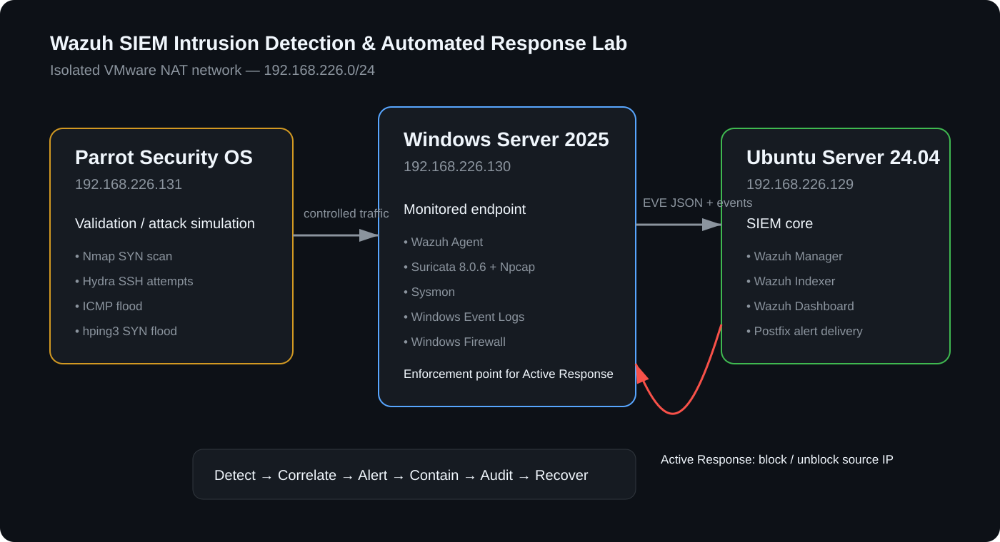

## Why this project exists

This project goes beyond deploying a SIEM dashboard. It builds a three-VM defensive monitoring environment, integrates network and endpoint telemetry, creates custom detections, validates them with controlled attack traffic, and implements an auditable automated response for a SYN-flood scenario.

The repository is a portfolio-oriented reconstruction of the practical implementation. It intentionally does **not** reproduce the university examination task or submitted academic report.

## Highlights

- Built a three-VM lab in VMware Workstation Pro 17.
- Deployed Wazuh manager, indexer and dashboard on Ubuntu Server 24.04.
- Integrated a Windows Server 2025 endpoint through the Wazuh agent.
- Integrated Suricata EVE JSON and Sysmon endpoint telemetry.
- Created four custom Suricata signatures for SYN scanning, SSH brute-force attempts, ICMP flooding and SYN flooding.
- Created Wazuh rules `100010–100015` for severity elevation and response auditing.
- Configured level-8 local email alerting through Postfix.
- Built a custom PowerShell Active Response that extracts `alert.data.src_ip` from Wazuh JSON and temporarily blocks the source through Windows Firewall.
- Logged block/unblock actions back into Windows Event Log and Wazuh using Event IDs `9001` and `9002`.
- Tuned Suricata EVE output and the Wazuh agent buffer after high-volume testing exposed field-count and queue limits.
- Validated the full SYN-flood lifecycle: **detection → level-8 alert → firewall block → response event → 60-second timeout → automatic unblock**.

## Lab topology

| System | Role | Address | Main components |
|---|---|---:|---|
| Ubuntu Server 24.04 | SIEM | `192.168.226.129` | Wazuh manager, indexer, dashboard; Suricata; Postfix |
| Windows Server 2025 | Monitored endpoint | `192.168.226.130` | Wazuh agent, Suricata 8.0.6, Sysmon, Windows Firewall |
| Parrot Security OS | Validation host | `192.168.226.131` | Nmap, Hydra, hping3 |

All addresses are private lab addresses on an isolated VMware NAT network (`192.168.226.0/24`).

## Detection engineering

| Suricata SID | Wazuh rule | Detection | Wazuh level |
|---:|---:|---|---:|
| `9000001` | `100010` | SYN/Nmap-style scan | 8 |
| `9000002` | `100011` | SSH brute-force pattern | 8 |
| `9000003` | `100012` | ICMP flood / ping sweep | 8 |
| `9000004` | `100013` | SYN flood / DoS pattern | 8 |
| — | `100014` | Firewall block recorded | 8 |
| — | `100015` | Temporary firewall block removed | 5 |

The actual rule files are available under [`configs/`](configs/).

## Automated response

```text
Parrot traffic
     │
     ▼
Suricata SID 9000004
     │ EVE JSON
     ▼
Wazuh rule 100013 (level 8)
     │
     ▼
Wazuh Active Response
     │
     ▼
suricata-block.cmd → suricata-block.ps1
     │
     ├─ extract alert.data.src_ip
     ├─ check_keys handshake
     ├─ create inbound Windows Firewall block
     └─ write Windows Event ID 9001
                    │
                    ▼
             Wazuh rule 100014

          [60-second timeout]
                    │
                    ▼
             Wazuh delete action
                    │
                    ├─ remove firewall rule
                    └─ write Event ID 9002
                              │
                              ▼
                       Wazuh rule 100015
```

This response was deliberately limited to the SYN-flood rule. Automated containment can disrupt legitimate traffic when a detection is wrong, so response scope and timeout were kept narrow for the lab.

## Evidence

### Environment and telemetry

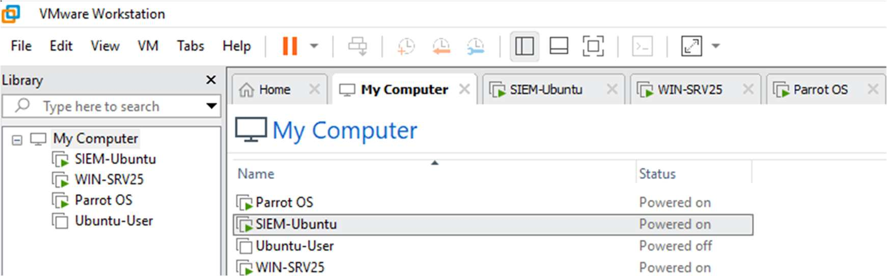
*Three active lab VMs in VMware Workstation.*

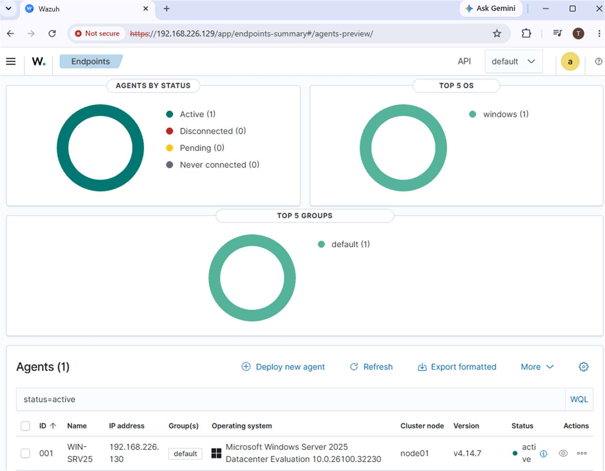
*Windows endpoint connected to Wazuh.*

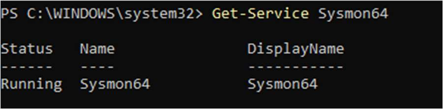
*Sysmon running on the Windows endpoint.*

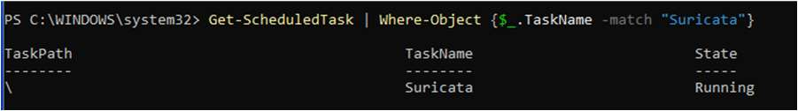
*Suricata running persistently through Task Scheduler after Windows service-mode instability.*

### Detection and alerting

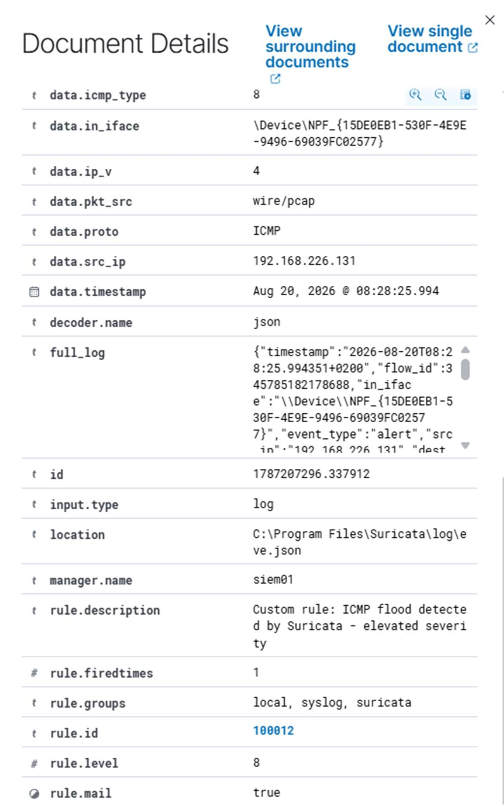
*Wazuh document detail for a custom Suricata detection.*

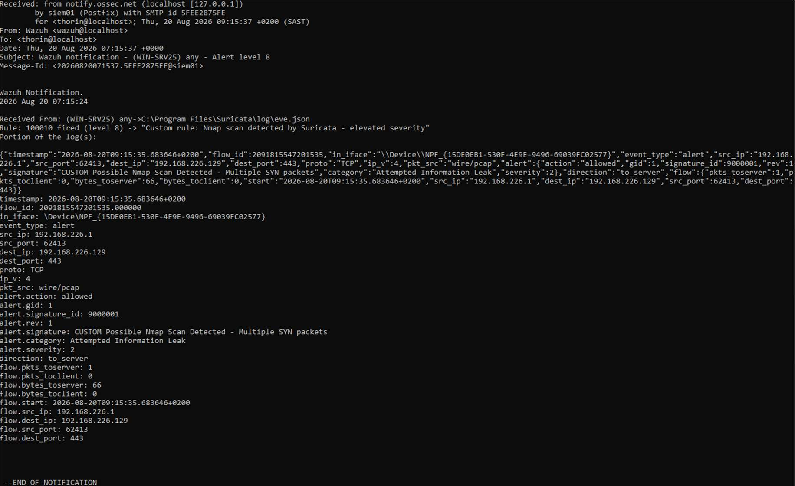
*Level-8 Wazuh notification delivered through local Postfix mail.*

### Automated containment

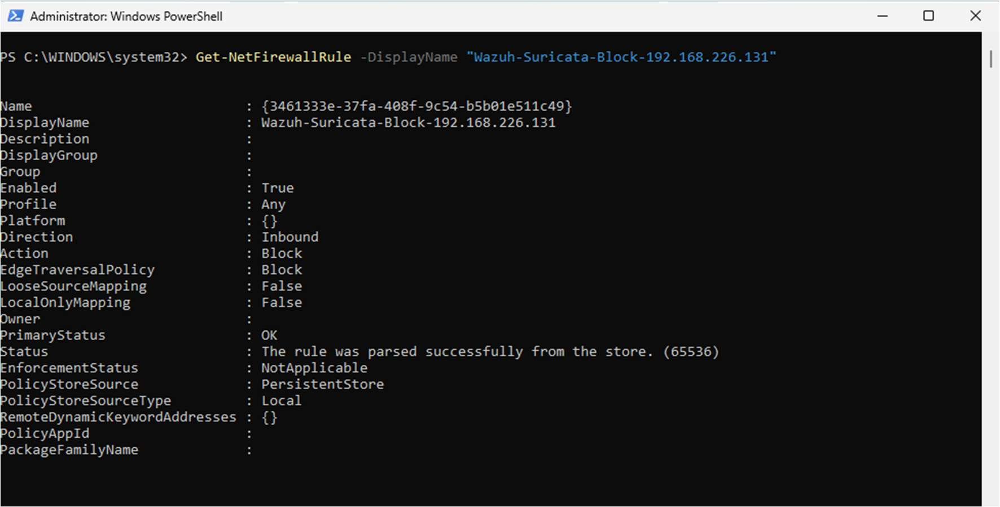
*Windows Firewall rule created for the detected source address.*

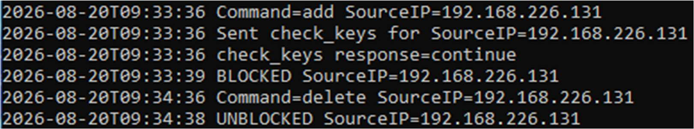
*Active Response audit trail showing add, `check_keys`, block, delete and unblock.*

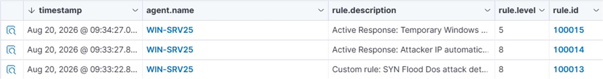
*Wazuh sequence showing SYN-flood detection (`100013`), block (`100014`) and unblock (`100015`).*

### Validation

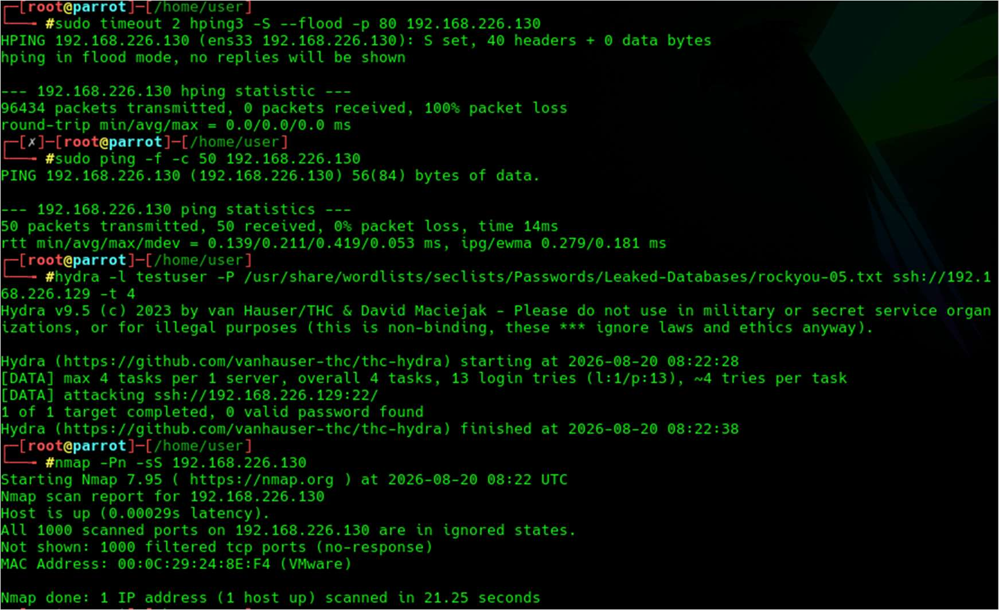
*Controlled Nmap, Hydra, ICMP and SYN-flood traffic generated from the Parrot VM.*

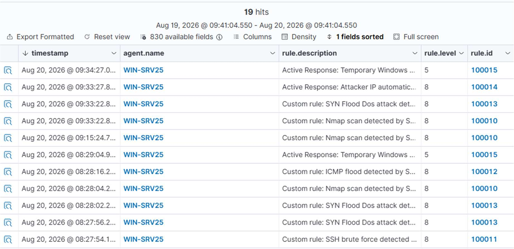
*Custom detections and Active Response events visible in Wazuh.*

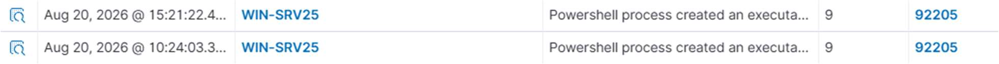
*Sysmon/Wazuh process telemetry producing a level-9 detection.*

## Engineering lessons

The most valuable part of the build was not simply getting alerts to appear. Reliability depended on packet-capture behaviour, stable addressing, JSON volume, endpoint buffering, XML syntax, Windows execution context and alert-rate limits. The troubleshooting record is documented in [`docs/troubleshooting.md`](docs/troubleshooting.md).

Notable fixes included moving core VMs from DHCP to static addressing, running Suricata through a highest-privilege startup task, limiting EVE JSON to alert events, increasing the Wazuh agent buffer, and replacing an unreliable `route-null`/custom-decoder approach with a PowerShell response that reads the source IP directly from Active Response JSON.

## Repository map

```text
.
├── README.md
├── LICENSE
├── .gitignore
├── SECURITY.md
├── docs/
│   ├── architecture.md
│   ├── architecture.svg
│   ├── detection-engineering.md
│   ├── active-response.md
│   ├── testing.md
│   ├── troubleshooting.md
│   └── cv-and-github-copy.md
├── configs/
│   ├── suricata/
│   │   ├── local.rules
│   │   └── eve-alert-only.example.yaml
│   └── wazuh/
│       ├── local_rules.xml
│       ├── active-response.example.xml
│       └── windows-agent.example.xml
├── scripts/active-response/
│   ├── suricata-block.cmd
│   └── suricata-block.ps1
└── screenshots/
```

## Skills demonstrated

**SIEM / SOC:** Wazuh, alert triage, log integration, custom rules, severity tuning, dashboard validation, alert notification  
**Network security:** Suricata, EVE JSON, signature/threshold rules, packet-capture troubleshooting  
**Endpoint telemetry:** Sysmon, Windows Event Channel, process lineage  
**Response engineering:** Wazuh Active Response, PowerShell, Windows Firewall, stateful `check_keys`, response auditing  
**Systems:** Ubuntu Server, Windows Server, Parrot Security OS, VMware, Postfix  
**Troubleshooting:** JSON field limits, event queues, static addressing, service context, XML validation, duplicate agent registration

## Scope and safety

This repository documents a controlled lab using private virtual machines. Validation commands are included only to make the defensive detections reproducible in an isolated environment. Do not run traffic-generation or credential-testing tools against systems you do not own or have explicit permission to test.

## License

Code and configuration examples in this repository are released under the MIT License. Third-party products and trademarks remain the property of their respective owners.
